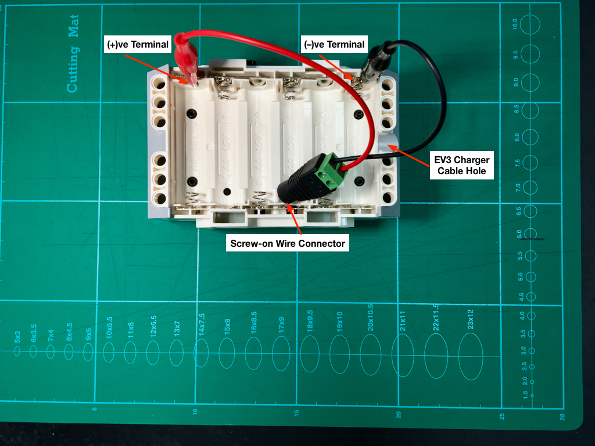
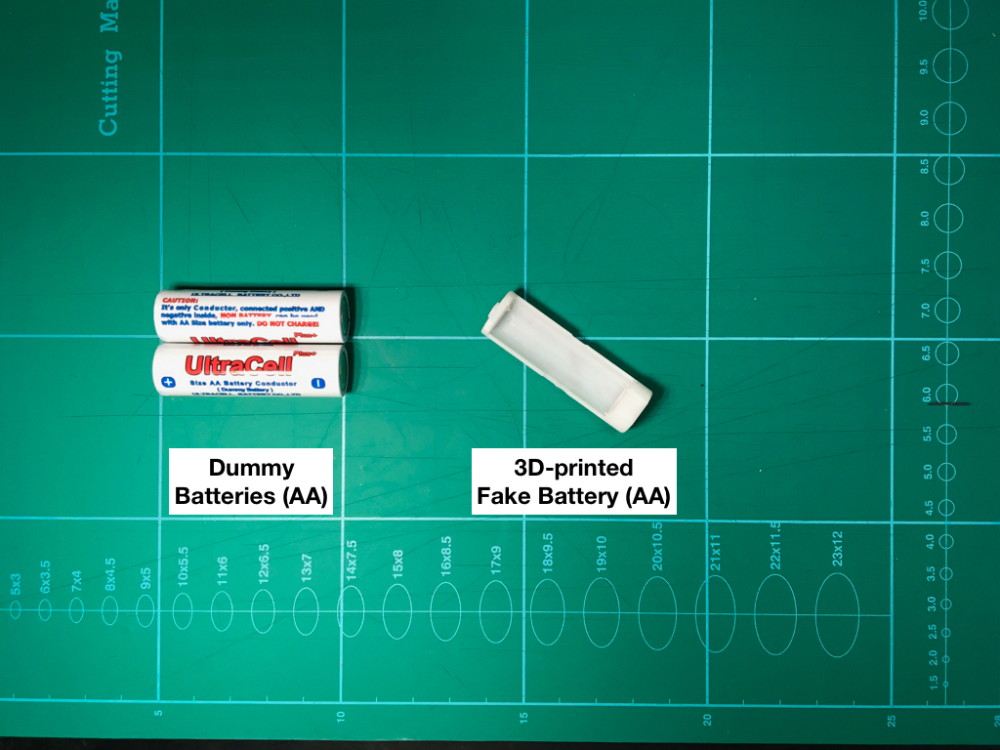

# Powering the EV3 Programmable Brick using a USB Cable

>WARNING:
>
>This is a hardware hack. There is a risk of damaging your EV3 Programmable Brick *if you're not sure of what you're doing*

## Introduction

The Retail EV3 Kit does not come with a rechargeable battery pack, and AA batteries run out very quickly when writing and debugging software.
In addition, some static EV3 models that need to be powered continually would also benefit from a constant power supply.

USB connected power is the best compromise between continual power and portable power. High Capacity Powerbanks are now widely available for charging portable devices, and can be used as an alternative to the EV3 rechargeable battery pack. The goal of this hack is to have a completely non-destructive power connection, so when the USB power cable is removed, the EV3 can be used with normal batteries or power pack easily. The battery compartment will not be modified when using the USB power connection.

The motivation for the hack originated from this [Guide](http://www.mindstormsrobots.com/lego-mindstorms/powering-the-lego-mindstorms-brick-from-a-9v-plugpack/)
In addition, useful information regarding power consumption of the EV3 can be found [here](http://fettricks.blogspot.my/2017/02/building-usb-charger-cable-for-your-fll.html).

The goal of this hack is to combine the two ideas, with some refinements to power the EV3 brick directly via USB. I'm not keen on a full DIY approach since it involves a lot of soldering and hacking.

>The limitation of using USB to power the EV3 brick is that the maximum power draw provided by the USB Power cable is unable to drive multiple motors drawing maximum current (motor locked condition). However, if your primary focus is on powering the EV3 brick to test program logic, then it is mostly sufficient. YMMV.

# Quick and Dirty Power Connection

Here we're not concerned about aesthetics or reliability of the connection. This is mostly useful for programming/testing at the workbench only. The battery cover will need to be removed in order to attach the crocodile clips to the battery terminals, so make sure that it is placed in a raised position and the clips will not be moved accidentally.

## Items Needed

- Multimeter
- Alligator clips with cable (1 pair)
- "Screw-on Wire Connector 5.5mm x 2.1mm female jack" (make sure that the dimension of the USB 9V power plug fits the jack)
- "USB 9V DC output Step-up Voltage Converter" (make sure that the dimension of the Screw-on Wire Connector jack fits the plug).

>WARNING: Be careful not to power the EV3 directly with > 9V at the battery input, otherwise there is the risk of damaging the brick. Consequently it is better to get a max. 9V output cable rather than one which can output a range of voltages including those higher than 9V.

## Steps

1. Check the USB cable 9V DC output voltage and polarity.
> This is an important step as we don't want to accidentally fry the EV3 Programmable Brick with an incorrect cable (Voltage > 9V), or connecting the polarity incorrectly.
>
> Note: My USB DC 9V output cable provides ~9.02V - ~9.05V according to the EV3 Battery Information, despite the fact that the multimeter reads 9V without load. I think it is still safe. However, **DO NOT** exceed 9.1V; the brick will be damaged if the voltage reaches 9.2V according to [this](http://www.mindstormsrobots.com/lego-mindstorms/powering-the-lego-mindstorms-brick-from-a-9v-plugpack/).
2. Wire the alligator clips to the Screw-on wire connector jack with the correct polarities. Typically Red wire is (+)ve, Black wire is (-)ve.
3. Remove the EV3 brick battery cover, and fasten the Alligator clips to the EV3 Battery contacts.

> WARNING: Be sure to connect the (+)ve clip to the (+)ve terminal, and (-)ve clip to the (-)ve terminal. The contact plates for the end terminals are the width of a single battery compartment only. The other contact plates are connected to the adjacent battery compartment in series.
4. Make sure that the EV3 brick is positioned in such a way as to keep the Alligator clips from getting detached due to the weight of the EV3 brick pressing on it.

# Making a Robust USB Power Connection

To make the power connection robust, we would need to create some additional parts using a 3D printer.

## Items Needed

- Multimeter
- "Screw-on Wire Connector 5.5mm x 2.1mm female jack" (make sure that the dimension of the USB 9V power plug fits the jack)
- "USB 9V DC output Step-up Voltage Converter" (make sure that the dimension of the Screw-on Wire Connector jack fits the plug).
- Terminal Spades with cable (search for "terminal spade", prefer Ring or Spades)

- [Fake Batteries](https://www.thingiverse.com/thing:122810)

> The Dummy Batteries are for illustration only: to use them follow the instructions in this [guide](http://www.mindstormsrobots.com/lego-mindstorms/powering-the-lego-mindstorms-brick-from-a-9v-plugpack/), with the power cables connected to the terminal spades instead of being soldered directly to the dummy batteries. The terminal spades are then either soldered to the dummy batteries (this makes the power terminal contact points more uniform), or else kept in place by the spring action of the dummy battery pressing the terminal spades against the power contacts . However, I find it more troublesome to use since the setup is not easy to fit within the battery compartment with a EV3 battery cover installed. 
>
> If you have access to a 3D printer, the Fake Batteries are more compact in terms of space utilization, and it is possible to reattach the battery compartment cover to keep the wires out of reach.
>
> You can make do with printing just the positive and negative battery frames. The fake battery covers are mostly for aesthetics purposes.

- [Replacement Battery Cover](https://www.thingiverse.com/thing:1799267)
> You can skip this step if you're willing to cut out the tab on the original EV3 Battery Cover that blocks the hole for the charger plug.
- Machine Screws and Nuts (sized to fit in fake battery contact holes and terminal rings)

## Steps
1. Check the USB cable 9V DC output voltage and polarity, similar to the `Quick and Dirty Power Connection` directions.
2. Assembly and Install the Fake Batteries. There are 2 designs, one for the (+)ve terminal and the other for the (-)ve terminal.

> Machine screws with the correct diameter are threaded through the hole in the Fake Battery, and the Terminal Spade is threaded on the screw, then soldered in place to provide good contact. Finally, a glue gun is used to secure the parts inside the Fake Battery together. The two Fake Batteries are then placed in the battery compartment.

3. Wire the fake batteries to the Screw-on wire connector jack with the correct polarities. Typically Red wire is (+)ve, Black wire is (-)ve. The screw-on wire connector jack will be outside the battery compartment.

4. Cover the Battery Compartment with the 3D-printed Battery Cover.

5. You can now use the EV3 with either a USB charger or a Powerbank.

