# Eclipse IDE

Eclipse is a comprehensive Integrated Development Environment by Eclipse Foundation, Inc. For C/C++ development, we will use the [Eclipse CDT build](http://www.eclipse.org/downloads/packages/eclipse-ide-cc-developers/oxygen3). The current version of the Eclipse platform is Oxygen.

The focus of this guide is to configure Eclispe for C cross-development and debugging using the [ev3dev-c](https://github.com/in4lio/ev3dev-c) libraries for the LEGO Mindstorms EV3 Controller. The steps should be similar for the other Robot Controller platforms except for ARM-architecture specific toolchain settings.

## Docker Cross-Compilation Image Setup

The cross-compilation process will be performed using [Docker](https://www.docker.com/community-edition), to ensure that the build environment libraries for linking with our programs are consistent with the ev3dev distribution libraries. 

Information about the ev3dev cross-compilation docker images are found [here](../toolchains/c-cpp-toolchains.md#compiling-projects-using-docker).


Setup the Docker Environment, and install the appropriate ev3dev docker image based on the version of the ev3dev distribution you're targeting.

To refer to the docker image in Eclipse, we'll tag it as `ev3cross`

```
$ docker tag <docker_cross_compiler_image> ev3cross
```

## Additional Eclipse Plugins Setup

Two additional Eclipse Plugins need to be installed from the Eclipse Marketplace:
* Eclipse Docker Tooling: Control and Invoke Docker from within Eclipse (works with Eclipse Neon release and later, tested with Oxygen)
* GNU MCU Eclipse: Cross-compiler toolchain integration, simplify creation of ARM-based projects in Eclipse

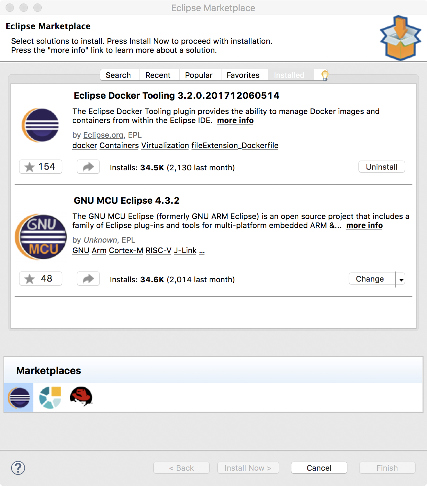

From the `Eclipse Marketplace`, search for the two plugins and install them.

# Creating a new ARM-based project in Eclipse

We'll create an ARM "Hello World" project in Eclipse as an example.
In Eclipse, select `File->New->C Project`. Choose the `Hello World ARM C Project` from the list.

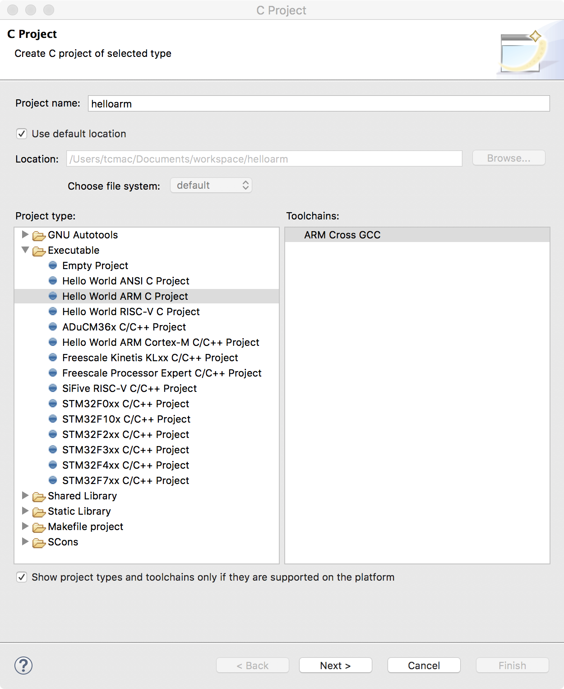

This will automatically configure the build environment to use the ARM Cross GCC Tools. After pressing `Next >`  it will then prompt you for the Cross GCC Toolchain to use. In our case, we will need to use the Custom option since the others are not relevant for our configuration (though we will need to modify the toolchain prefix later).

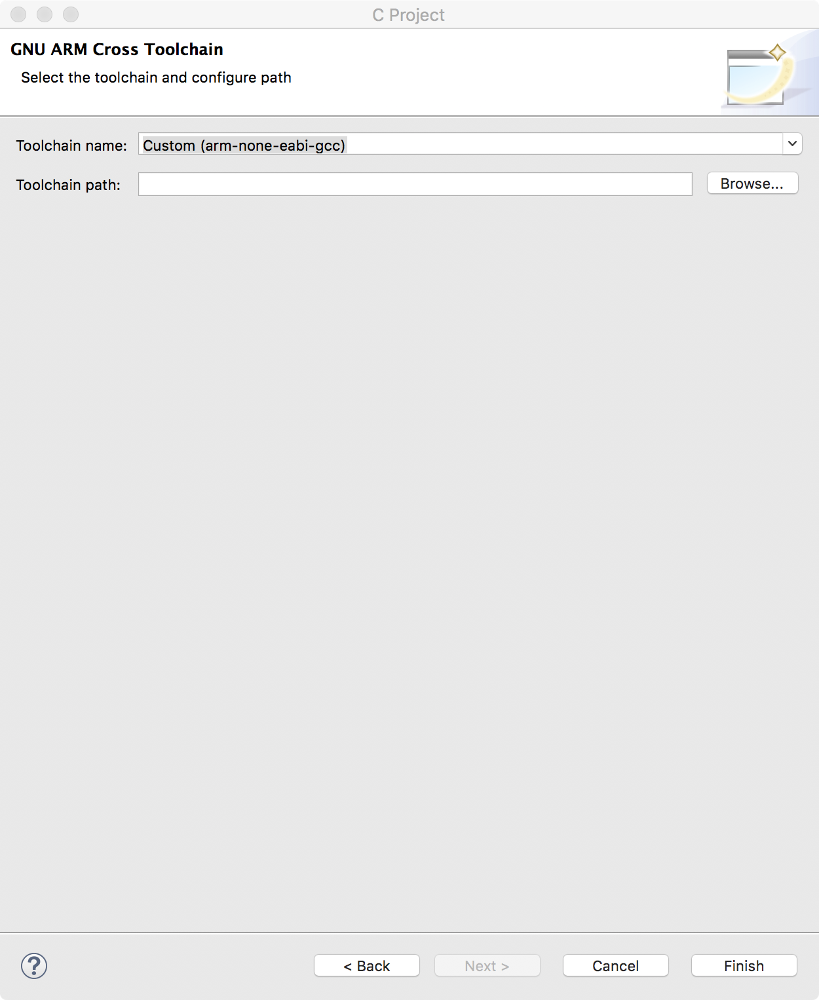

When you press `Finish` a new project and main.c will be created.

## Configuring Project Settings

The Build Settings for the newly created project needs to be updated next.
First, select the newly created project folder. If you don't do this Eclipse will not know which project configuration it needs to modify.

Then, select `Project->Properties` and then expand the parameter list for `C/C++ Build->Settings`. This should display the `Tool Settings` tab. 

### Configuring Target Processor

Under `Target processor`, select the appropriate ARM family. For the LEGO Mindstorms EV3, it is `arm926ej-s`. The architecture and instruction set should be set to `Toolchain default`

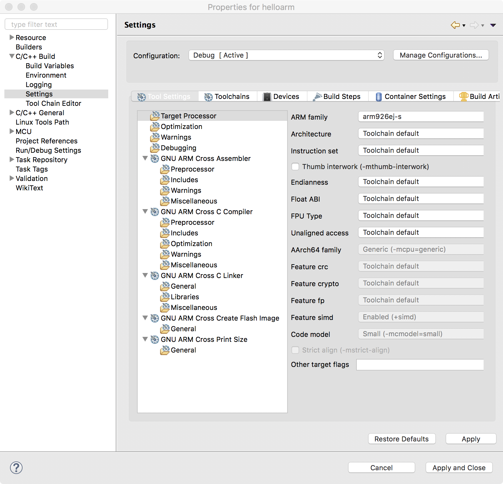

### Configuring Linker Parameters

Then the Linker `Miscelleanous` setting should be configured. The GNU MCU Plugin assumes the use of bare-metal debugging setup and hence includes reference to rdimon. This is not used for ev3dev. References to `rdimon.specs` and `rdimon` should be removed.

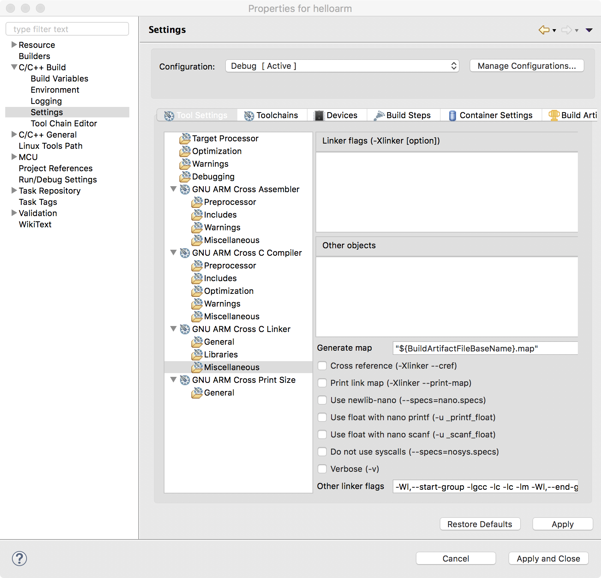

After removing references to rdimon, you can verify the updated Linker settings by selecting the Linker overall settings.

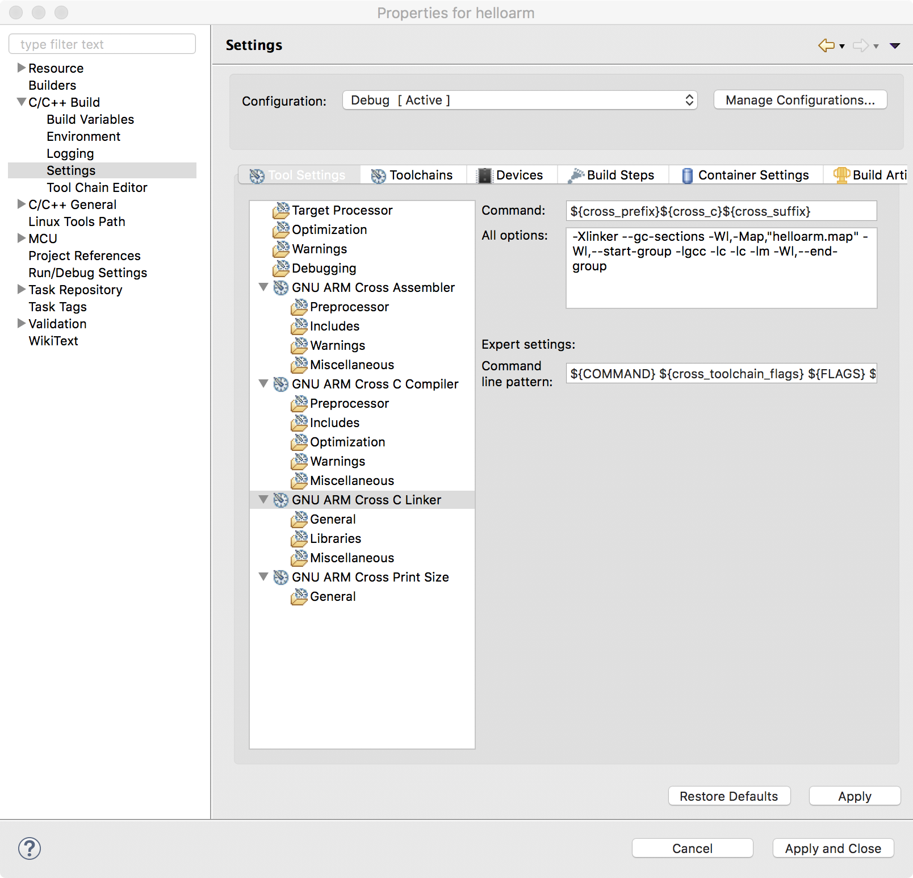

### Configuring Cross Toolchain prefix
Configuring the Cross Toolchain prefix is the following step.
As mentioned previously, `arm-none-eabi-` is not the correct cross-compilation toolchain prefix for `ev3dev` in the Docker cross-compiler image. Instead, it should be set to `arm-linux-gnueabi-`. In addition, we should uncheck the `Create Flash Image` option since we're not going to flash it to the robot controller.

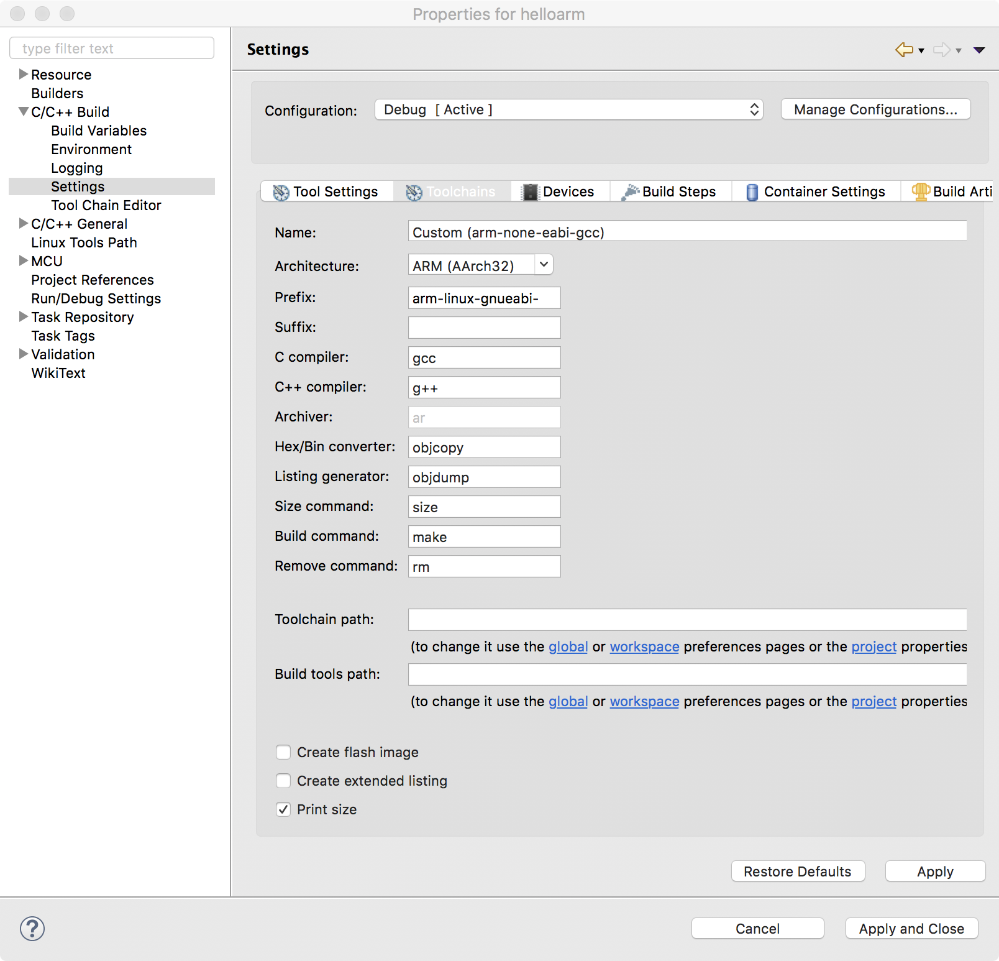

### Configuring Docker Settings

Next the build needs to be setup to target the Docker container. Switch to the `Container Settings` tab. The checkmark `Build inside Docker Image` should be checked. In addition the name of the Docker Image can be selected from the drop down menu (assuming that it was configured and tagged properly for Docker previously).

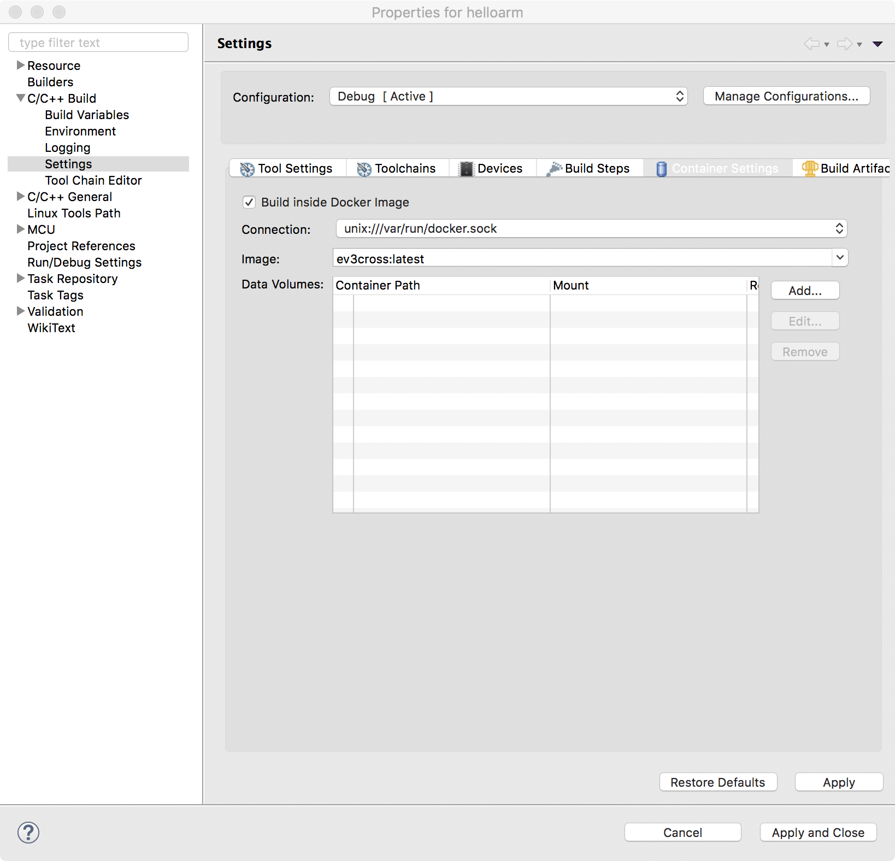

The Docker Plugin automagically mounts the project directories into the Docker image and launches the build process. This makes it more flexible compared to manually invoking the Docker image, which require us to specify the project paths as part of the `docker run` command. 

# Building ARM-based Project Using Docker

Once all that is done, the next step is to build the project. 
With the project folder selected in the Project Explorer View, initiate a `Project->Build Project` action. The Eclipse console should display the progress of the build.

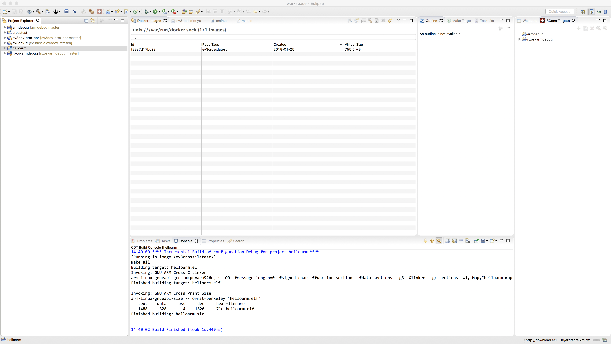

If there are build errors, you would need to determine if the problem lies with the toolchain configuration or if it is a project related (programming) error.

## Importing ev3dev-c as an Eclipse ARM-based Project

Since we're interested in C-based programming for ev3dev, we will first import the ev3dev-c project from github.

```
$ git clone https://github.com/in4lio/ev3dev-c.git
```

From Eclipse, select `File->Import` and choose `C/C++->Existing Code as Makefile Project`.
Enter the project name `ev3dev-c` and setup the `Existing Code Location` path.
In addition, select `ARM Cross GCC` as the Toolchain.

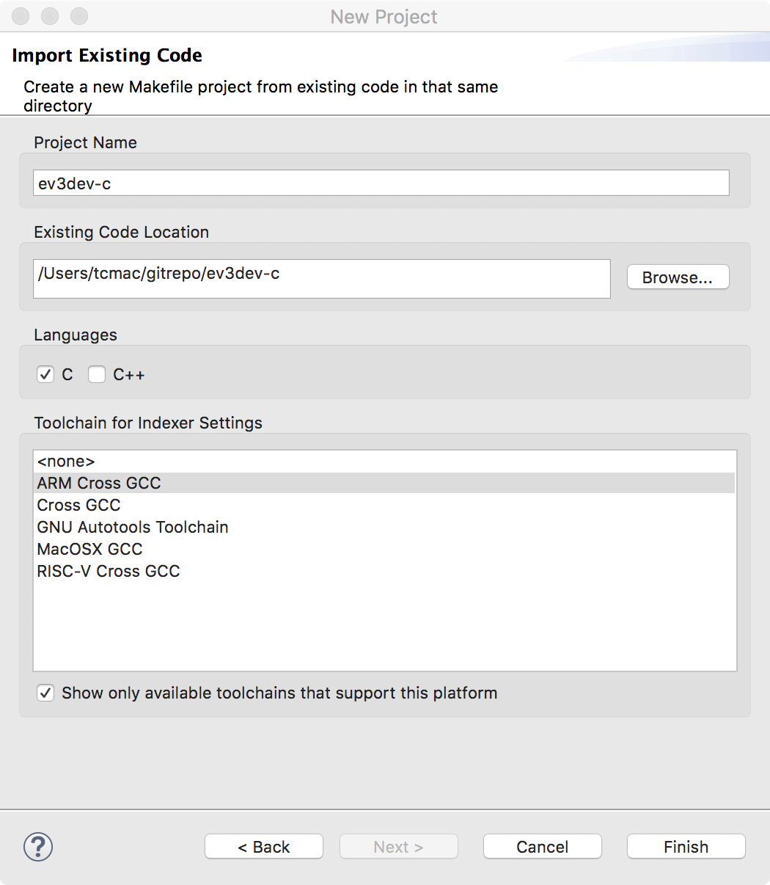

## Configuring Project Paths

The configuration of the Project Settings is similar to the steps for [ARM-based Projects](#configuring-project-settings).
However, Imported C Projects does not have the `Tool Setting` tab because they are unmanaged C projects in Eclipse.
Consequently generated code would default to the compiler default unless specific compiler flags are defined.

The `Build command` has to be configured explicitly, since the ${cross_make} variable is not defined.
Make sure that `Generate Makefiles automatically` is turned off, otherwise project builds will most probably not function correctly. In addition, the `Build location` should default to the project directory.

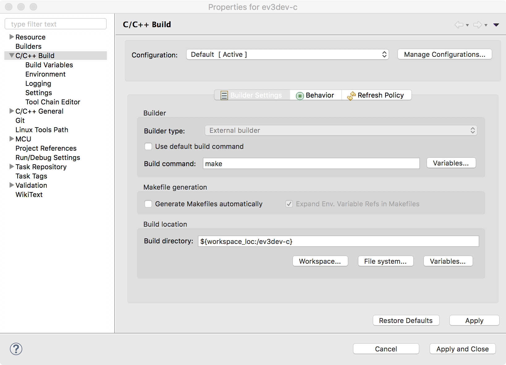


## Building specific program in ev3dev

> We will use the io example in ev3dev-c as the target program.

You will need to specify the Build Target to be built. `Project->Build Targets->Create...`
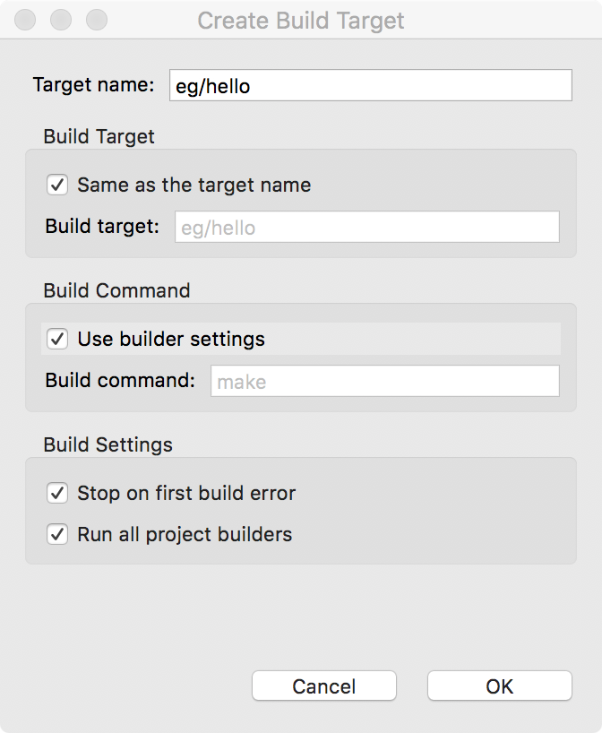

After the target has been created, build the specific target by selecting it from the Build Targets list.

# Remotely Debug ARM-based program Using Eclipse

## Setup Multiarch GDB on Host Platform (PC)

Eclipse will use the Host GDB Cross Debugger as the Debugging Client.
On macOS with MacPorts, you can install GDB with multiarch support as follows:
```
$ sudo port install gdb +multiarch
```
The executable will be named `ggdb`.

## SSH connection over USB

Remote access to the EV3 can be over WiFi (if a USB WiFi dongle is available), or else over the USB cable. SSH over USB will be more reliable and somewhat faster compared to SSH over WiFi.

To enable SSH over USB, the USB interface must be enabled in ev3dev via Brickman. It will be listed as a Wired Interface. 

(TBD)

## Configuring Debugger parameters in Eclipse for ev3dev-c

> We will use the io example in ev3dev-c as the target program.

To setup Remote Debugging on the Robot Controller, select `Run->Debug Configurations` from the menu. Then select `C/C++ Remote Application` and create a new launch configuration (from the icon bar in the left panel of the dialog). This will display the Launch Configuration setup form.

In the `Main` tab, enter the project name `ev3dev-c` and specify the correct C/C++ application name. the `${project_loc}` variable will allow us to reference the project directory regardless of where it is in the file system.

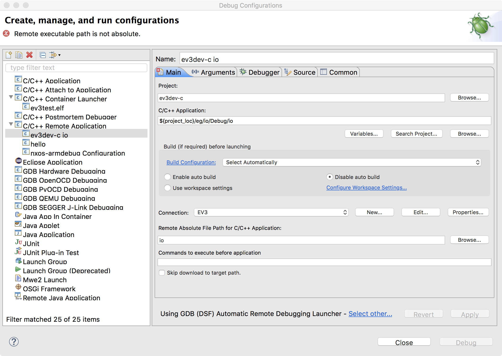

The `Remote Absolute File Path for C/C++ Application` is used by the Debugger to find and launch the application on the Target (Robot Controller). In our case, we will enter the name of the executable without the absolute path, since it will be placed in the home directory of the target username by default.

Next, the Connection to the Robot Controller needs to be configured. Select the `New...` button for the Connection, and select `SSH` as the connection type.
In the SSH configuration screen, enter the appropriate information such as IP Address of the Robot Controller, Username, and Password or Passphrase for Public Key authentication as appropriate. If you're using Public Key authentication, be sure to configure the path to the public key correctly.

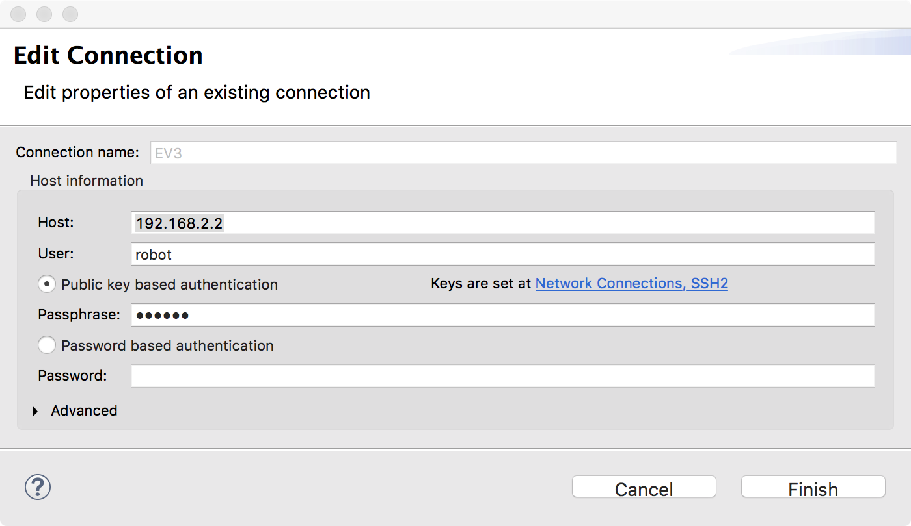

To setup the Debugger, click on the `Debugger` tab. The path to the GDB Debugger needs to be specified correctly. On macOS running MacPorts GDB, it should be `/opt/local/bin/ggdb`. The GDB Command file is optional. You might want to include some GDB configuration parameters to be executed on startup. For example, the Multiarch GDB does not seem to know how to parse the application ELF file to determine the target type. This can be fixed using:
```
set gnutarget elf32-littlearm
```

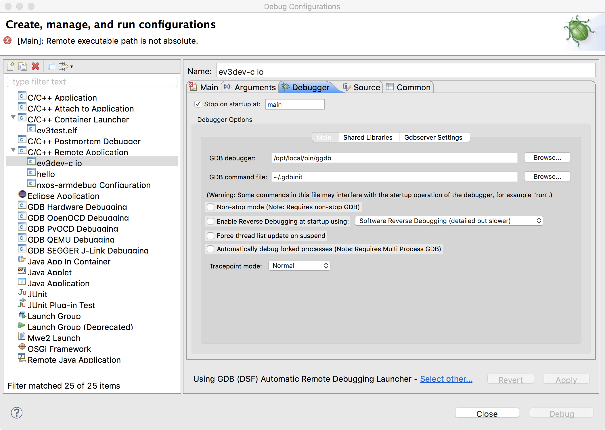

## Debugging Perspective for Eclipse

After the configuration of the Debug Launch Configuration, launch it, and switch over to the Eclipse Debug Perspective. 

Eclipse will copy the built application from the Host (PC) to the Target (Robot Controller) username's home directory via SSH and then launch it using the `Remote Absolute File Path for C/C++ Application`

The Debug Perspective will show the process panel and which routine the program is currently stopped in, the variables and breakpoints inspection panel, a listing of the current line in the source file, and the console information for GDB.

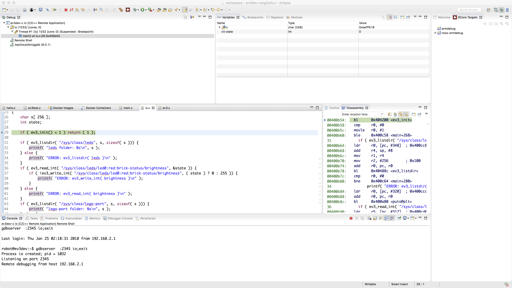

The contents of variables and CPU registers can be inspected via the top middle panel.

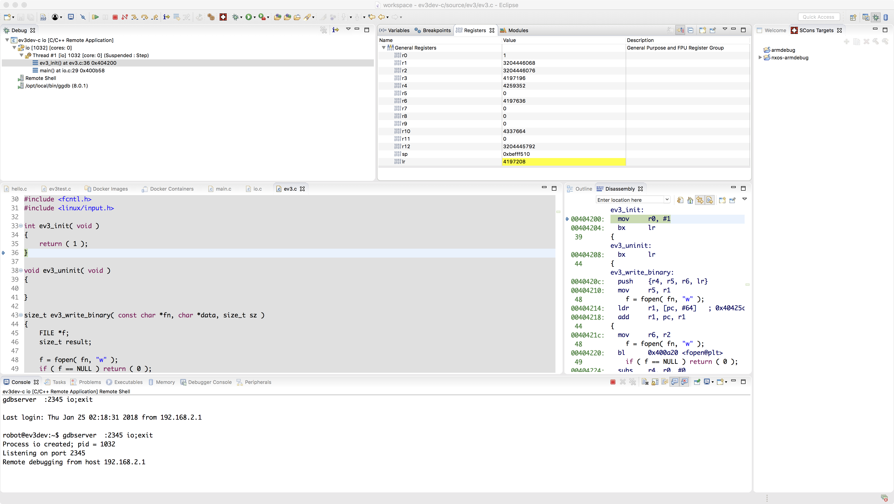
