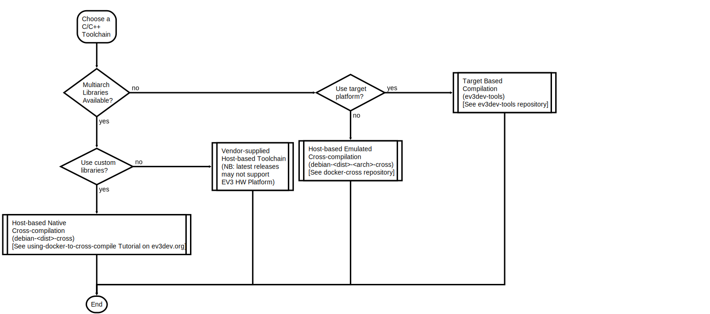

# Selecting a C/C++ Toolchain for ev3dev

Four options are available for C/C++:
1. Target-based (Native) Compilation (compiler running on Robot Controller): This is not a recommended configuration for large projects due to the limited storage, processing power and RAM on the Robot Controller. You'll need the [build-essential](https://packages.debian.org/stretch/build-essential) apt package.
2. Host-based Emulated Cross-Compilation: If custom libraries were only available for the Target platform; the cross-compilers are actually Target-based compilers running in an emulator on the Host (PC). Look for [`debian-<dist>-<arch>-cross`](https://github.com/ev3dev/docker-cross) docker images.
3. Host-based Native Cross-Compilation: If multi-architecture custom libraries were available on the Host (PC) platform; this is the most efficient configuration. Look for [`debian-<dist>-cross`](https://github.com/ev3dev/docker-cross) docker images.
4. Vendor supplied Host-based Cross-Compilation Toolchain: The latest versions of the vendor toolchains may not support the Robot Controller platform. See [C++ Language Bindings Project](https://github.com/ddemidov/ev3dev-lang-cpp) for a link to vendor supplied packages.

> It is important to select the correct Target environment for the cross compiler; otherwise the generated programs will not be able to run on the targeted Robot controller platform. Generally we should use a generic Cross-Compiler which can generate executables for multiple target architectures. 
>
>However, if you're building on the Target platform natively, or else intend to run the architecture specific cross-compiler under emulation on the Host to build with custom libraries which are only available for the given target architecture, GCC provides architecture specific compiler and cross-compiler toolchains that takes less disk space compared with the multi-target cross-compilers.

When cross-compiling using a GCC Cross-Toolchain, the selected target architecture *MUST* be compliant with the chosen Robot Controller platform distribution (EV3 Brick, RPi, etc.), otherwise unexpected problems may occur. There are three [Target Architectures](https://www.debian.org/ports/arm/) for ARM-based Debian distributions used by ev3dev depending on the Controller hardware platform:
 * armel (for EV3 Programmable Brick)
 * armhf for ARMv6 (for the original Raspberry Pi and Pi Zero, **Docker Cross-compiler Image not provided currently**)
 * armhf for ARMv7 (for Raspberry Pi 2, 3, and Beaglebone)

>ev3dev has packaged the relevant GCC Cross-compiler Toolchain in [Docker](https://www.docker.com/what-docker) containers to simplify the installation of a POSIX-compliant development environment for the Host.

# Project Build Tools 

We assume the use of [Makefiles](https://en.wikipedia.org/wiki/Makefile) for managing compilation of projects containing multiple source files and/or libraries

## Creating project Makefiles

The default building process adopted by ev3dev and many other projects uses [`make`](https://www.gnu.org/software/make/) to manage the compilation of files after they have been edited or modified. There are many other build management tools available, each with different strengths and weaknesses. Nonetheless, the default starting point is to use your IDE to create the necessary project build files, and modify it if necessary for advanced build features. For example, Eclipse CDT with the [GNU MCU Eclipse plugin](https://gnu-mcu-eclipse.github.io/) would create standard project folders with the necessary Makefiles for you automatically when creating a New Project.

*FIXME: Need some additional HOWTOs for Make*

# Setting up Library and Include Paths for Custom Libraries

This involves specifying the custom library paths passed to the cross-compiler and linker. 
For GCC, the compiler command line switches are:
* `-L <path-to-library>`
* `-I <path-to-include-directory>`

In addition, for the generation of the complete program, all custom libraries used by the program would need to be linked with the object files for the program using:
* `-l <library-archive>`

> This assumes static linking of libraries used by the program