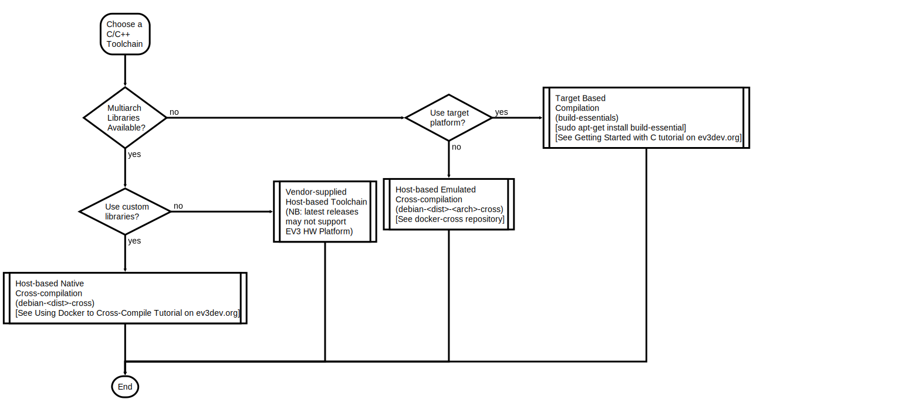

# C/C++ Toolchain Guide

## Selecting a C/C++ Toolchain for ev3dev



Four options are available for C/C++:
1. Target-based (Native) Compilation (compiler running on Robot Controller): This is not a recommended configuration for large projects due to the limited storage, processing power and RAM on the Robot Controller. You'll need the [build-essential](https://packages.debian.org/stretch/build-essential) apt package.
2. Host-based Emulated Cross-Compilation: If custom libraries were only available for the Target platform; the cross-compilers are actually Target-based compilers running in an emulator on the Host (PC). Look for [`debian-<dist>-<arch>-cross`](https://github.com/ev3dev/docker-cross) docker images.
3. Host-based Native Cross-Compilation: If multi-architecture custom libraries were available on the Host (PC) platform; this is the most efficient configuration. Look for [`debian-<dist>-cross`](https://github.com/ev3dev/docker-cross) docker images.
4. Vendor supplied Host-based Cross-Compilation Toolchain: The latest versions of the vendor toolchains may not support the Robot Controller platform. See [C++ Language Bindings Project](https://github.com/ddemidov/ev3dev-lang-cpp) for a link to vendor supplied packages.

> It is important to select the correct Target environment for the cross compiler; otherwise the generated programs will not be able to run on the targeted Robot controller platform. Generally we should use a generic Cross-Compiler which can generate executables for multiple target architectures. 
>
>However, if you're building on the Target platform natively, or else intend to run the architecture specific cross-compiler under emulation on the Host to build with custom libraries which are only available for the given target architecture, GCC provides architecture specific compiler and cross-compiler toolchains that takes less disk space compared with the multi-target cross-compilers.

When cross-compiling using a GCC Cross-Toolchain, the selected target architecture *MUST* be compliant with the chosen Robot Controller platform distribution (EV3 Brick, RPi, etc.), otherwise unexpected problems may occur. There are three [Target Architectures](https://www.debian.org/ports/arm/) for ARM-based Debian distributions used by ev3dev depending on the Controller hardware platform:
 * armel (for EV3 Programmable Brick)
 * armhf for ARMv6 (for the original Raspberry Pi and Pi Zero, **Docker Cross-compiler Image not provided currently**)
 * armhf for ARMv7 (for Raspberry Pi 2, 3, and Beaglebone)

>ev3dev has packaged the relevant GCC Cross-compiler Toolchain in [Docker](https://www.docker.com/what-docker) containers to simplify the installation of a POSIX-compliant development environment for the Host.

## Project Build Tools 

The typical development workflow involves iteration through various Coding-Compiling-Debugging cycles.

While Integrated Development Environments (IDEs) have reduced the complexity of performing each of those steps in the development workflow, as well as automate many of the steps involved, it is important to note that each of the required step can always be invoked from the Shell. It is therefore useful to know some of the command line parameters used by the respective tools; and it is still necessary to configure the IDE correctly so that it will perform the necessary steps for building the project.

We assume the use of [Makefiles](https://en.wikipedia.org/wiki/Makefile) for managing compilation of projects containing multiple source files and/or libraries.

### Creating project Makefiles

The default building process adopted by ev3dev and many other projects uses [`make`](https://www.gnu.org/software/make/) to manage the compilation of files after they have been edited or modified. There are many other build management tools available, each with different strengths and weaknesses. Nonetheless, the default starting point is to use your IDE to create the necessary project build files, and modify it if necessary for advanced build features. For example, Eclipse CDT with the [GNU MCU Eclipse plugin](https://gnu-mcu-eclipse.github.io/) would create standard project folders with the necessary Makefiles for you automatically when creating a New Project.

Some references on how to create/customize Makefiles:
* [Wikibooks Make Tutorial](https://en.wikibooks.org/wiki/Make)
* [Using GCC and Make](https://www3.ntu.edu.sg/home/ehchua/programming/cpp/gcc_make.html)
* [GNU Make Reference](https://www.gnu.org/software/make/manual/make.html)

## Setting up Library and Include Paths for Custom Libraries

This involves specifying the custom library paths passed to the cross-compiler and linker. 
For GCC, the compiler command line switches are:
* `-L <path-to-library>`
* `-I <path-to-include-directory>`

In addition, for the generation of the complete program, all custom libraries used by the program would need to be linked with the object files for the program using:
* `-l <library-archive>`

> This assumes static linking of libraries used by the program

## Compiling Projects Using Docker

Docker images encapsulates all the required cross-compilation tools into a container which is setup specifically for cross-compiling programs for the target platform. The advantage of using Docker is that the configuration of the toolchain is done once and can be replicated precisely on different Hosts. 

The project directory is maintained and its contents edited on the Host OS environment.
This will provide the best interactive performance since the editor or IDE is running natively.
 
In order to use the cross-compiler toolchain images for ev3dev development, you will need to mount the project directory into the docker image as a `volume`. This allows the docker image to read the project files, as well as write the generated object and application files to the Host project directory. 

> The docker image acts like a remote computer for the purpose of performing the compilation. Virtual Machine images can be used to accomplish this purpose as well but the overheads incurred by running a VM image is much greater compared with the overheads for running a docker image.
>
> It is important to note that the mounted project directory works like a shared network drive to allow the Host to exchange information with the Docker image. Anything else that is needed by the cross-compiler toolchain inside the docker image must have been installed beforehand, otherwise it is not accessible from with the docker image.
>
> This is especially true for any custom headers and libraries used by the project. If the custom headers and libraries were not pre-installed in the docker image, then it must be available via some mounted volume, or else included as a subproject within the project directory.

See [Using Docker to Cross-Compiler](http://www.ev3dev.org/docs/tutorials/using-docker-to-cross-compile/) for information on how to build software using the docker environment.

## Compiling with Debugging Information

GCC uses `-g` to enable debugging symbols generation for the object file. 
It is important to specify `-g` when compiling, otherwise the debugger would not be able to access the symbols to display the program context when setting breakpoints and stepping through the code.

We would also need to build any custom libraries with `-g` as well if we plan to step through the library functions. If we link the custom libraries statically, those debug symbols will also be included in the executable file. Otherwise, the debug symbols for shared libraries need to be made available on the Target platform and made accessible to the debugger.

> For the ev3dev distribution, `libc6-dbg` contains the C-library debug symbols.
> `sudo apt install libc6-dbg` can be used to install the debugger symbols in the target platform.

## Remote Debugging

Remote debugging requires that a Debugging Stub runs on the Target, which communicates with the Debugger Client (front end) running on the Host for issuing debugging commands and examining register and variable values.
The Debugger for GCC is GNU Debugger ([GDB](https://www.gnu.org/software/gdb/documentation/)). It is a text-based debugger which can be run from the terminal.
For cross-debugging, we need to use a GDB compiled for multiarch support. This allows us to run the Debugger Client (`gdb`) on the Host and interact with the remote Debugger Stub (`gdbserver`) which understands the ARM architecture registers. 

> `gdbserver` may not be installed in the default `ev3dev` Linux image for your Robot Controller. You can install it by doing the following:
```
$ sudo apt update
$ sudo apt-get install gdbserver
``` 

### Using GDB from the command line
> See [Using GDB](http://www.ev3dev.org/docs/tutorials/using-docker-to-cross-compile/#using-gdb) for an example of how to use breakpoints to control execution of the application.

In order for the multiarch GDB client to understand which specific target type to use, we need to issue the following configuration command:

> `set gnutarget elf32-littlearm`

The configuration command can be added to `~/.gdbinit` so that it is automatically enabled each time.

> The `~` symbol refers to the user's home directory.

### Using GDB from an IDE

IDEs can simplify the remote debugging process, by automatically downloading the compiled application, invoking gdbserver, and presenting a GUI-based interface for the GDB client when invoking the debugging process.
Since the steps involved in debugging using an IDE is specific to the IDE, you should refer to the relevant guide for further information:
* [Remote Debugging Using Eclipse](../programming/eclipse-ide.md#remotely-debug-arm-based-program-using-eclipse)
