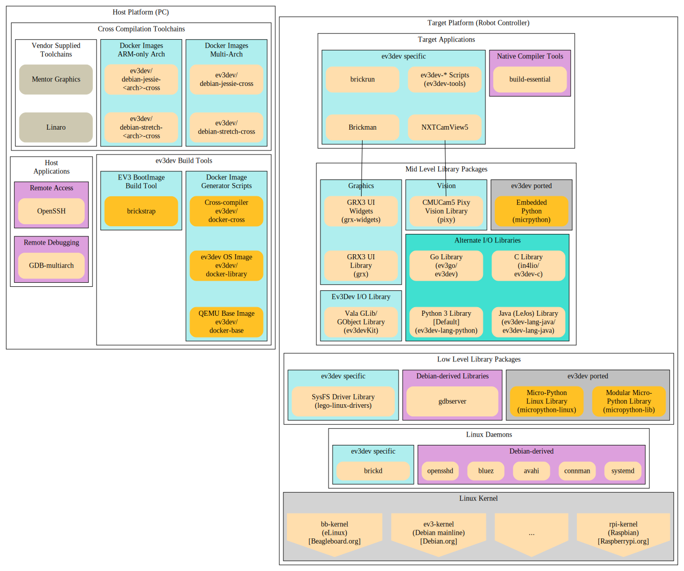

# Development Workflow

## Introduction

The standard LEGO Mindstorms EV3 Controller (better known as the LEGO Mindstorms EV3 Programmable Brick) is a Linux-based computing platform (referred to in the rest of this page as a Robot Controller) for interfacing with the various motors and sensors for the Mindstorms environment.

LEGO provides the EV3 Programmer software which uses a graphical programming paradigm, originating from National Instruments' LabView platform, to develop programs to run on the EV3 Brick. However, these executables stored in `*.rbf` files are actually virtual machine bytecode files (conceptually similar to Java Bytecodes) that run on top of the LMS Virtual Machine.

Alternatively, others are interested in writing programs that execute directly on the EV3 Brick, bypassing the LMS Virtual Machine. Commercial solutions include [`RobotC`](http://www.robotc.net/) which supports C-like programming for the EV3 Brick to create the `*.rbf` virtual machine bytecode files for their custom firmware.

Nonetheless, since the EV3 Brick Operating System is based on Linux, we have various alternatives to commercially available tools. ev3dev provides a Debian-based Linux distribution to support people interested in writing code directly for the Linux environment using open source tools. This also opens up the possibility of using other Robot Controllers such as the Raspberry Pi, Beaglebone boards (with appropriate motor and sensor expansion capes), and others which have higher processing capabilities compared to the EV3 Brick to run software written for the ev3dev distribution.

The basic process to start developing on ev3dev is as follows:
1. [Choose a Language](@choosing-a-language)
2. [Choose a Toolchain](#choosing-a-toolchain)
3. [Build and Install the Libraries](#building-and-installing-the-libraries)
4. [Write your Programs](#writing-your-programs)
5. [Download Program to Target](#downloading-programs-to-target)
6. [Run/Debug the Program](#running-and-debugging-programs)

# Choosing a Language

While it is a bit daunting to start by choosing a [Programming Language](http://www.ev3dev.org/docs/programming-languages) if you're new to programming, the list of languages are more or less sorted from easiest for beginners such as Python, to more advanced options such as C++ and C.

# Choosing a Toolchain

## Workflow is dependant on the programming language

>This mostly applies to more advanced language options. 

For Python-based development, almost everything is already built-in to the ev3dev distribution; all you need is a Text Editor or [Integrated Development Environment](https://en.wikipedia.org/wiki/Integrated_development_environment) (IDE) to write your programs in, and then execute it on the Robot Controller (after downloading if necessary).

> The pre-built ev3dev image has everything you need, unless you're interested in installing non-standard library packages into the ev3dev image (this is an advanced topic which is not covered in this guide). 

For the other languages, there is a need to compile the source files into executable files that will be run on the Robot Controller. Technically, it is possible to write and compile programs on the Robot Controller platform (this is also known as Target (Native) Compilation), but that would be an exercise in frustration except for compiling trivial programs such as `Hello World!`. 

Typically we would want to use our Host PC to write, compile and debug the program, since it is much more powerful than the Robot Controller platform. However, the Robot Controller uses a different CPU or Instruction Set compared with the ones typically used on your PC. 

>More specifically, the available Robot Controllers are ~~almost~~ all based on the ARM CPU Architecture, while the PC are (almost) all based on the x86 or x64 (Intel-Architecture compatible) CPU Architecture.

Bytecode based languages such as the LEGO Programmer and Java will have Compilers that compile the source programs into Virtual Machine bytecodes, which is able to run on any platform having the appropriate Virtual Machine software. However, the default C and C++ compilers for the PC platform targets the x86 or x64 CPU Architecture, and cannot be run on the Robot Controller. 

Consequently, when compiling C and C++ programs on the PC to run on the Robot Controller, we need to perform [Cross Compilation](https://en.wikipedia.org/wiki/Cross_compiler). The C and C++ cross compilers used by ev3dev are based on the GNU Compiler Collection ([`GCC`](https://gcc.gnu.org/)).

## Toolchain Selection

You can use the following Toolchain Selection Guide for your chosen programming languages as a reference:
* [Python](http://www.ev3dev.org/docs/tutorials/setting-up-python-pycharm/)
* [C/C++](../toolchains/c-cpp-toolchains.md)
* TBD

## Software Packages for Host and Target Platforms

It is important to keep in mind that you're dealing with two separate Operating Systems environments when developing software for ev3dev, the **Host** (PC) environment and the **Target** (Robot Controller) environment. The **Host** environment typically would be based on Windows, macOS, or Linux Operating Systems, while the **Target** will be based on the Debian Linux-derived ev3dev Distribution. Nonetheless, the following discussion assumes the use of a [POSIX compliant](https://en.wikipedia.org/wiki/POSIX) environment for the **Host**. 



### Host Packages

Packages maintained by ev3dev are highlighted in turquiose to indicate that they are used for building applications for the e3vdev platform. In addition, some examples of vendor-supplied C/C++ Cross compilers are listed for reference. Standard packages (default packages provided by third parties for the Host OS) are highlighted in plum.

The essential components for developing on the Host are:
* Integrated Development Environment (IDE) or Text Editor
>While it is not the intention of this guide to recommend any particular IDE, since it is highly subjective regarding which is the *best* (and this is often a contentious debate); take a look at [List of IDEs](https://github.com/ev3dev/ev3dev/blob/ev3dev-stretch/docs/programming/ides.rst) to find an IDE which is suited to your programming language, OS and development style.
* Development Toolchain
> See [Toolchain Selection](#toolchain-selection) for information relevant to your chosen programming language.
* Remote Access / Terminal program 
> While it is possible to connect a Serial cable to the EV3 and use a Terminal program to interact with the system, it requires a custom [cable](http://botbench.com/blog/2013/08/15/ev3-creating-console-cable/) or [adapter](http://www.mindsensors.com/ev3-and-nxt/40-console-adapter-for-ev3) and is only able to provide basic Input/Output capabilities. Network-based remote access is much more flexible since it supports file transfers and device-to-device communications, and is the recommended way to connect to the system.
>
> Of course, a serial console is necessary if you're doing low level (e.g. kernel) development and/or the networking configuration is toast, but then you'd probably know what you're doing and won't need to refer to this guide in the first place.
>
> We assume use of [OpenSSH client](https://en.wikipedia.org/wiki/OpenSSH) to access and login to the ev3dev Robot Controller remotely.
* Executable Program Downloader from Host (PC) to Target 
> Since the executable program was compiled on the Host, we need to transfer it to the Target in order to execute it. The easiest way to do so is to use a network connection, since it does not involve removing and inserting SD cards or USB Flash drives repeatedly.
>
> e.g., OpenSSH provides `scp` (Secure Copy) for transferring files.

* Cross-Debugger 
> This usually comes with the Cross-compiler Toolchain, but can also be provided as part of the IDE.
>
> In order to debug the applications running on the Robot Controller, we must control the instruction execution on the Robot Controller using a Debugger. A Cross-Debugger runs on the Host, sending commands via the network link to the Target which runs a small debugger stub to control the application directly.
>
> In ev3dev, GDB and GDB Server are the Host Cross-Debugger and Target debgger stub respectively.

* Other Packages

> Several build tools are provided for building ev3dev Distribution Boot images or GCC Cross-compiler toolchains for Docker. 
>
> These build tools are not needed unless you plan to create custom toolchains or custom ev3dev Distribution images.

### Target Packages

>This is not meant as an exhaustive list of all packages used, but to highlight those essential or relevant for the operation of the ev3dev environment.

The description of the packages starts from the bottom layer, since the lower layers of the OS are common to the upper layers. The ev3dev specific packages are highlighted in turquiose to indicate that they are specifically developed for the e3vdev platform. Debian-derived packages (default packages provided by the Debian Linux Distribution) are highlighted in plum. Additionally, packages highlighted in dark gray indicate third-party packages ported for use with the e3vdev distribution.

* Platform specific Kernel (part of ev3dev Boot Image (only ev3dev-kernel based kernel provided currently)
* Linux Daemons (part of ev3dev Boot Image)
* Low-level Library Packages (part of ev3dev Boot Image)
* Mid-level Library Packages

> Micropython is included as part of the ev3dev Boot Image. 
>
>The other ev3dev specific libraries listed here are for reference only. They are not included in the Boot Image but but will be statically linked in with the program where necessary
* Target Applications

> Native Compiler Tools are not included in the ev3dev Boot Image, since users are expected to perform cross-compilation.
>
>* Brickman is the GUI interface for ev3dev (included as part of the ev3dev Boot Image)
>* brickrun is the command line program launcher for ev3dev (also called by Brickman internally) 
>* System Information and Configuration scripts: ev3dev-sysinfo and ev3dev-config from the [ev3dev-tools](https://github.com/ev3dev/ev3dev-tools) repository
>* Others (***FIXME***)

### Header Files

The use of the various libraries in ev3dev for development requires installing the relevant header (include) files for the Cross-compilation platform on the Host. This is documented in the  [Building and Installing the Libraries](#building-and-installing-the-libraries) section.

>Take a look at [Organization of ev3dev Repositories](ev3dev-Repositories) for more information regarding the packages maintained by the ev3dev project, including available Language Bindings and support libraries.


# Building and Installing the Libraries

## Clone the Language-specific Repository

Based on the chosen [Programming Language](http://www.ev3dev.org/docs/programming-languages) and toolchain, the specific repository should be cloned to your Host (PC) platform. 
> The *Getting Started* guide for a programming language may suggest doing it on the Robot Controller, but if you plan on working with a large project with multiple (> 10) source files, it is advisable to choose a proper cross-compilation workflow due to the large storage requirements for compilation, as well as the issue of it being much slower due to the limited processing capabilities and RAM on the Robot Controller. 

## Install the Library Headers and Archives

Typically cross-platform development uses statically linked libraries to create the final program. 

>While dynamically loaded libraries may save some space on the boot image, the compilation and linking step is more complicated, and it is up to the developer to make sure that the version of the libraries on the boot image is the correct version for the given application.

In this step, you need to take note of the directory locations for both the Library archive files (`*.a`), as well as the include header files. They would typically be different from the paths to the Host (PC) compiler libraries and include files.

>On Linux, the standard library path is in `/usr/lib`, while the standard include path is in `/usr/include`, they are used to keep all system-wide library archives and include files. 
>
>Cross-compilation is considered an example of using custom libraries. The standard libraries for the cross-compiler would also usually be stored in a well known location such as `/usr/local/` or `/opt/local`, depending on the vendor or packager of the cross-compilation toolchain. Normally, you won't need to specify the path to the standard libraries and header files for the cross-compiler .
>
>On top of that, the libraries for supporting EV3 cross-compilation is another set of custom libraries that we need to access from our programs. There may not be a standard location for accessing those files, except for the location where the libraries were cloned to, though well designed custom libraries usually allow us to install it to the same directories as the cross-compiler libraries and headers for easier access. 

Therefore, it is important when compiling with custom libraries to specify the correct path to the header directory and the library archive correctly to the compiler and linker, so that it will know how to access the needed files unless they could be installed to the standard locations.

# Writing Your Programs

It is not the intention of this guide to go into detailed description of every step, but the things to be aware of are:

* Program Lifecycle
* Building the program incrementally
* Use of the Editor or IDE features for syntax checking and API completion
* Adoption of common style-guidelines for consistency with existing projects/code
* Using source revision management software to track changes made to the program

## Program Lifecycle

Every program follows the basic life cycle for applications:
* Genesis of an idea (spark)
* Breaking down the idea into manageable components
* Sketch out essential logic of specific components
* Test out the basic functionality of a component (prototyping, also include running and debugging the program)
* Refine the functionality based on prototype
* Iterate until you're happy with the outcome
* Archive/freeze program development and/or share with others

There are many ways (formally termed development paradigms) to carry out these steps, some may not even consciously adopt a given paradigm but it came out naturally as part of the exploration. Nonetheless, having some semblance of a structured sequence would help reduce the frustrations and confusions involved with program development as the project scales up in complexity.

## Building the Program Incrementally

*Rome was not built in a day*, and it is not likely that your program will be completed in a single programming session unless it is meant to test a simple scenario. 

Executable applications often consist of multiple modules and source files, which may be updated at different times during the development process. Only source files that were changed need to be recompiled. The naive approach is to just compile every source file regardless of whether they were modified or not. This may work well for small projects, but as the size of the project grows, significant amount of time might be spent waiting for the compilation to complete. 

Instead of compiling each and every source files over and over again, developers rely on various Project Build tools to manage the updating of the executable application based on changes made to specific source files. A common build tool for POSIX environments is [`make`](https://www.gnu.org/software/make/), used by many development projects to manage and automate the build process.

> Make works by comparing the timestamps on the headers files and source files with the timestamps on the object code and executable files. It is important to keep the Real-Time Clock (RTC) running consistently (i.e., timestamps do not jump backwards) on the development machine in order not to confuse Make.
>
> When in doubt, `make clean` should delete all the generated object and executable files and give you a clean slate to recompile everything.

## Syntax highlighting and API completion

One of the major advantages of using an IDE as opposed to a normal text editor is the capability to highlight the programming language syntax to ease comprehension and bug tracking. While purists may insist on using no-frills text editor for speed in entering the program code, a large portion of the programmer's time is actually spent understanding the program logic and how to convert it into the appropriate syntax used by the chosen programming language. Hence, IDEs with good syntax highlighting is a great help in reducing logical errors introduced during the course of programming.

If the IDE was configured well, it is even possible for it to provide prompts for function parameters and reference to the appropriate header files when looking up the definition of a particular function call.
This is another useful feature especially when dealing with custom libraries and APIs (not the standard language supplied library APIs)

## Adoption of Common Style Guidelines

Very often we start from example projects or code taken from other open source projects. This is the basis for ev3dev after all. While it is tempting to just add new code to the project willy-nilly, it is better to try and be consistent with the existing project style guidelines, to ensure readability as well as future sharing of the code with others. 

> Large projects frequently have strict style guidelines and will not accept code contribution from others which do not meet those guidelines.

## Using Source Revision Management Software

Source code control, revision management, or code control, refer to the task of managing changes to the program code over time. The ability to roll back a change which introduced an unexpected bug, or to test out new features while the already working code is being used actively, is a powerful feature of Source Revision Management Software. Beyond these typical features that benefit an individual programmer tremendously, almost all source revision management software also allows collaboration with other programmers to improve the code and work on larger projects in a team.

Since this is a huge topic in itself, this guide will not get into further details, except to note that knowledge of commonly-used source revision management software is a useful skill for any programmer to know, and is well worth the time investment involved. If you're new to this whole concept of source code control, [Git](https://git-scm.com/) is the go-to software for source revision management today.

>For reference, all ev3dev projects are using Git for source code control; Git is the basis for all projects hosted on GitHub as well.

# Downloading Programs to Target

* Enabling Networking on the Target
* Setting Up SSH Access
* Using Public Key Authentication
* Downloading/copying Programs to the Robot Controller

## Enabling Networking on the Target

See the topic on [Networking](http://www.ev3dev.org/docs/networking/) for more information on how to enable network access on the Robot Controller.

## Setting up SSH Access

Secure Shell (SSH) is the recommended way to connect to the Robot Controller from the Host. The most commonly used SSH package is OpenSSH, which is supported by all the major OSes. Alternatively, Putty is available on Windows as a SSH client.

> The default Developer's Firmware from LEGO uses `telnet` for access to the EV3 running `D` version firmware. Resist all temptations to install or use `telnet` and `telnetd` on ev3dev, as it is an obsolete remote access protocol which transmits *EVERYTHING* you type in cleartext over the network link. You should excise any usage of `telnet` from your repertoire of command line tools as it is the road to grief and [security compromises](https://translate.google.com/translate?sl=auto&tl=en&js=y&prev=_t&hl=en&ie=UTF-8&u=http%3A%2F%2Fwww.heise.de%2Fsecurity%2Fartikel%2FAnalysiert-Lego-Mindstorms-fuer-Cyber-Angriffe-missbraucht-3055305.html&edit-text=&act=url).

The basic way of connecting to the Robot Controller is to specify the username and host information to the SSH client:
```
$ ssh robot@<robotcontroller> 
[where <robotcontroller> is either the hostname or IP address of the Robot Controller]
```

e.g., 

```
$ssh robot@192.168.2.2
```

The first time you connect to the Robot Controller, it might complain that it is an unknown host, or else the cached Robot Controller credentials does not match.
If it is indeed the first time you're connecting to the particular controller, you can accept the prompt. If it complains about non-matching credentials, you may need to remove the old cached entry manually.

After the connection is established, SSH will present the login prompt for the password.
You can then login to the ev3dev environment using the appropriate password. (the default password is `maker`).

> See [Connecting to Ev3dev Using SSH](http://www.ev3dev.org/docs/tutorials/connecting-to-ev3dev-with-ssh/) for more information.
>

If this is your personal EV3, it is of course prudent to change the password to something other than the default. 

>In a Lab environment, your instructor may advise you to use the default password to avoid unnecessary problems logging into the Robot Controller.

Changing passwords on ev3dev is the same as on any Linux distribution:

```
$ passwd
```

## Using Public Key Authentication

Once you've mastered logging in using SSH, and is frustrated with the constant need to type in your password at the login prompt, you can explore the use of Public Key Authentication for SSH login.

[Creating SSH Login Keys](https://www.ssh.com/ssh/keygen/)

> Remember to copy the SSH Login Public Key to the server. `ssh-copy-id` is one way of doing so.
>
> The advantage of using Public Key Authentication is that you don't need to transmit your password over the network link (even if it is encrypted) when logging in. In addition, the security of using Public Key Authentication is much better since the credentials are much longer than the typical user password.

You should protect the SSH Login Key with a passphrase (specified during the Login Key generation step). Most SSH client software can automatically unlock the SSH Login Key from your Host OS environment using `ssh-agent` , so that you don't even have to manually type in your passphrase to unlock the SSH Login Key each time. This make logging in to the Robot Controller a single step by just issuing the ssh command with the appropriate username and hostname/ip address.

## Downloading Programs to the Robot Controller

Executable applications need to be accessed by the ev3dev OS on the Robot Controller in order to run the program that you've created. The easiest way to do this is to transfer the application from the Host to the Target using `scp` from a Host console. 

e.g.,
```
[On Host]
$ scp <application_file> robot@192.168.2.2:
```
> Note that there is a colon `:` after the IP address. It is important to include the colon, otherwise `scp` will  just copy it to a local file with the name `robot@192.168.2.2`!

Once the application has been copied over to the Target, you should check that the application can be executed. This is done by displaying the file permissions.

```
[On Target]
$ ls -al <application_file>

-rwxr-xr-x  1 robot robot [FILESIZE] [DATE] <application_file>
```
The file permissions should include `x` (executable flag). See [Unix Fundamentals](https://github.com/ev3dev/ev3dev/blob/ev3dev-stretch/docs/programming/fundamentals.rst) for information on how to change file permissions.

# Running and Debugging Programs

To test the application, we would normally build the software with debugging symbols. This extra information is usually removed when building for the release (non-debugging) version as it makes the filesize much smaller.

